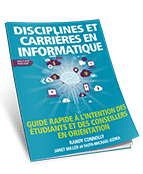

# :blue_book: Guide écoles informatique
Salut toi, si tu es là c'est que tu veux devenir un pros en informatique!

**Tu te demande comment faire pour y arriver ?**

## Contenu

* [Pourquoi l'informatique ?](#Pourquoi-l'informatique-?)
  * [Emplois](#Emplois)
  * [Apsect Social](#apsect-Social)
  * [Mobilité](#mobilité)
  * [Innovation](#innovation)
  * [Flexibilité](#flexibilité)
  * [Variété](#Varitété)
* [Disciplines et carrière en informatiaue](#Disciplines-et-carrière-en-informatiaue)
* [Écoles d'Informatique](#Écoles-d'Informatique)
  *  [Sénégal](#Sénégal)
        * [Dakar](#Dakar) 
        * [Diourbel](#Diourbel)
        * [Kaolack](#Kaolack)
        * [Louga](#Louga)
        * [Thiès](#Thiès)
        * [Saint-Louis](#Saint-Louis)
        * [Ziguinchor](#Ziguinchor)
  * [Djibouti](#Djibouti)
  * [Maroc](#Maroc)
  * [États-Unis](#États-Unis)
  * [Royaume-Uni](#Royaume-Uni)
  * [Suisse](#Suisse)
  * [Singapour](#Singapour)
  * [Canada](#Canada)
  * [France](#France)
  * [Auto apprentissage](#Auto-apprentissage)

## Pourquoi l'informatique ?

* ### Emplois
        Le marché de l’emploi pour les diplômés en informatique est très vigoureux, et les estimations gouvernementales prévoient que la demande va rester élevée pendant longtemps.

* ### Apsect Social
        Les métiers liés à l’informatique présentent un aspect social souvent très important qui suppose des interactions fréquentes avec les autres et met en valeur les aptitudes à la communication.

* ### Mobilité
        La demande dans le secteur de l’informatique est internationale. Une carrière en informatique offre une mobilité sans pareil et permet de travailler à l’étranger ou en voyageant.

* ### Innovation
        Les métiers liés à l’informatique peuvent être sources d’innovation et de créativité. Ce sont les diplômés en informatique d’aujourd’hui qui créent le monde de demain.

* ### Flexibilité
        Les métiers liés à l’informatique offrent une certaine flexibilité. On peut travailler à plein temps dans un bureau ou à temps partiel chez soi si l’on a un enfant, ou encore profiter des offres internationales de contrats à court terme.

* ### Varitété
        Les métiers liés à l’informatique sont extrêmement variés, et vont du développement à la conception en passant par la gestion. On court moins de risques de s’ennuyer quand le travail évolue, souvent de façon notable, d’une année sur l’autre.

## Disciplines et carrière en informatique

Pour en apprendre d'avantage sur les cinq grandes disciplines de l’informatique :

* **Science informatique**
* **Génie informatique**
* **Systèmes d’information**
* **Technologie de l’information**
* **Génie logiciel**

Je vous invites à télécharger le guide suivant

[Disciplines et carrières en informatique guide rapide à l’intention des étudiants et des conseillers en orientation (2e édition, ©2020) (FR version)
Taille: 27.06 MB Format : PDF](https://ceric.ca/download/880/fr/38835/disciplines-et-carrieres-en-informatique-guide-rapide-a-lintention-des-etudiants-et-des-conseillers-en-orientation-2e-edition-2020-fr-version.pdf)

## Écoles d'Informatique

* ### Sénégal
  * [UVS - Université virtuelle du Sénégal](https://www.uvs.sn)
  * #### Dakar
    * [CIGA - Centre d’informatique et de gestion appliquée](https://ciga-formation.com)
    * [Dakar Institute of Technology](https://dit.sn)
    * [ENSUP Afrique](https://www.ensupafrique.com)
    * [ESIA SENEGAL](http://www.esia.edu.sn)
    * [ESIMTEL - École supérieure d’informatique, de management et de télécommunications](https://academie-plus.com)
    * [ESTIM - École supérieure de télécommunication, d’Informatique et de management](https://www.estim.sn)
    * [ESGE-SA - Ecole Supérieure de Génies](http://www.esge.sn)
    * [ESMT - École Supérieure Multinationales des télécommunications](https://www.esmt.sn)
    * [ESNT - Ecole supérieure des nouvelles technologies](https://www.esnt.sn)
    * [ESP - École Supérieure Polytechnique de DAKAR](http://www.esp.sn)
    * [ESSA - Ecole supérieure des sciences appliquées](https://www.essa-dakar.com)
    * [ESTM - École Supérieure de Technologie et de Management](https://www.estm.sn)
    * [IIST - Institut International des Sciences et Technologie](http://www.iist-hilight.com)
    * [IHE - Institut des Hautes Etudes](http://www.ihedakar.com)
    * [IMC - Institut de management et de communication](http://www.imc.sn)
    * [Institut Edge](https://institutedge.org)
    * [INEFSAGEP - Institut privé d’études et de formation en statistiques appliquées et en gestion et évaluation de projet](http://www.inefsagep.org)
    * [IPROSI - Institut professionnel pour la sécurité informatique](https://iprosi.com)
    * [It-school CITS](https://www.itschool-cits.com)
    * [IPD – L'Université Professionnelle Africaine](http://ipd.sn/wp)
    * [Groupe AFI - l’université de l’entreprise](https://www.afi-ue.sn)
    * Groupe Agif - Informatique / IFIG (Dakar)
    * [Groupe IAM](https://www.groupeiam.com)
    * [Groupe ISM](https://www.groupeism.sn)
    * [Groupe ISMEC - ISST / Institut Supérieur de Management et d’Etudes Commerciales - Institut Supérieur des Sciences et Technologies](http://www.ismec.sn)
    * [Groupe ISI (Institut Superieur d'Informatique)](http://www.groupeisi.com)
    * [Groupe SUPdeCo](https://www.supdeco.sn/)
    * [MIT University de Dakar](http://www.mit-university.net)
    * [NIIT Senegal](http://www.niit.sn)
    * [SUPTEC-BATIS - Institut supérieur des nouvelles technologies de commerce et des bâtiments](https://suptecbatis.net)
    * [Up’Tech](http://www.uptechformation.com)
    * UCAD - Université Cheikh Anta Diop
      * [L’école doctorale de Mathématiques et Informatique](http://edmi.ucad.sn)
      * TDSI - Master Transmission des Données et Sécurité de l'information
    * [UDB - Université Dakar Bourguiba](http://udb-sn.com)
    * [UPAM - Université Privée Africaine Moderne](https://upam-senegal.business.site)
    * [Université de l’Atlantique](http://www.universat.org)
    * [University of Management](http://www.universityofmanagement.sn)
  * #### Diourbel
    * ISM - Institut supérieur de management (Touba Mbacké)
    * [UADB - Technicien informatique à l’Univers Alioune Diop de Bambey](http://www.uadb.edu.sn)
    * [ISI - Institut Supérieur d'Informatique](https://www.groupeisi.com/?p=47142)
  * #### Kaolack
    * ISM - Institut supérieur de management
  * #### Louga
    * ISM - Institut supérieur de management
  * #### Thiès
    * [IPAIM - Institut privé africain en informatique et management](https://www.ipaim.sn)
    * [ISEP - Institut Supérieur d’Enseignement Professionnel](https://www.isep-thies.sn/)
    * ISM - Institut supérieur de management (Thiès)
    * ISM - Institut supérieur de management (MBour)
    * [UT - Génie Informatique à l'Université de Thies](https://www.univ-thies.sn)
  * #### Saint-Louis
    * ISM - Institut supérieur de management
    * [UGB - Université Gaston Berger](https://www.ugb.sn)
  * #### Ziguinchor
    * [ISM - Institut Supérieur de Management](https://www.ismcasamance.sn)
    * [UASZ - Université Assane Seck de Ziguinchor](https://uasz.sn)
    * [ISI - Institut Supérieur d'Informatique](https://www.groupeisi.com/?p=49177)
    * [AFZ - Alliance Française Ziguinchor](http://www.afziguinchor.org/?page_id=340)
  

* ### Djibouti
  * Université de Djibouti
    *  LABDL - Licence Appliquée Base de Données et Logiciels
    * LART - Licence Appliquée en Réseaux et Télécommunications 

* ### Maroc
  * [Ecole Supérieur d’ingénierie Informatique Et de Multimédias à Casablanca‎](https://www.es2im.ma)

* ### États-Unis

* ### Royaume-Uni

* ### Suisse
  * #### Formations de base
    * [CFPT - Centre de formation professionnelle technique de Genève](https://edu.ge.ch/site/cfpt/)  
    * [CPLN - Centre Professionnel du Littoral Neuchâtel](https://cpne.ch/)
    * [Ecole des Métiers Techniques du Jura](https://www.divtec.ch/ecole-des-metiers-techniques/) 
    * [EMF - Ecole des Métiers Fribourg](https://www.fr.ch/emf)
    * [EPTM - Ecole Professionnelle Technique et des Métiers](https://eptm.ch/)
    * [ETML - L'Ecole Technique - Ecole des Métiers de Lausanne](https://www.etml.ch/)

  * #### Formations supérieures
    * [EPFL - École Polytechnique Fédérale de Lausanne](https://www.epfl.ch/fr/)
    * [ESIG - Ecole Supérieure d'Informatique de Gestion](http://www.esig-jura.ch)
    * [IDEC - Ecole supérieure d'informatique](https://idec.swiss/bf/)
    * [ISEIG - Institut Suisse d'Enseignement de l'Informatique de Gestion](https://iseig.ch/)

* ### Singapour

* ### Canada
  * [Université Laval au Québec](https://www.ulaval.ca)

* ### France
  * [3iL Ingénieurs](https://diplomeo.com/etablissement-groupe_3il-11343)
  * [CESI École d’Ingénieurs](https://diplomeo.com/etablissement-cesi_ecole_d_ingenieurs-7575)
  * [CPE Lyon](https://diplomeo.com/etablissement-cpe_lyon_ecole_superieure_de_chimie_physique_electronique_de_lyon-1954)
  * [EFREI Paris](https://diplomeo.com/etablissement-efrei_ecole_d_ingenieur_generaliste_informatique_et_technologies_du_numerique_paris-2384)
  * Ecole polivalente superieur d'informatique et d electronique (EPSIEL)
  * [EPITA](https://diplomeo.com/etablissement-epita_ecole_pour_l_informatique_et_les_techniques_avancees-2058)
  * [EPITECH](https://diplomeo.com/etablissement-epitech-7585)
  * [EPSI](https://diplomeo.com/etablissement-epsi-7570)
  * [ESIEA Grande École d’Ingénieurs](https://diplomeo.com/etablissement-esiea_ecole_d_ingenieurs_du_monde_numerique-10725)
  * [ESGI École Supérieur de Génie Informatique](https://diplomeo.com/etablissement-esgi_ecole_superieure_de_genie_informatique-11690)
  * [HETIC](https://diplomeo.com/etablissement-hetic_la_grande_ecole_de_l_internet-2910)
  * [IN'TECH](https://diplomeo.com/etablissement-in_tech_info_ecole_superieure_d_ingenierie_informatique_du_groupe_esiea-4044)
  * IMERIR, Institut Méditerranéen d’Etudes et Recherche en Informatique et Robotique (Perpignan)
  * [ISEP](https://diplomeo.com/etablissement-isep_institut_superieur_d_electronique_de_paris_institut_catholique_de_paris-4200)
  * [Grenoble INP — Esisar](https://diplomeo.com/etablissement-esisar_ecole_nationale_superieure_en_systemes_avances_et_reseaux_grenoble_inp-2102)
  * ParisTech Télécom (Paris)
  * [Sup Galilée - Université Paris 13](https://diplomeo.com/etablissement-institut_galilee_universite_paris_13-4837)
  * [SUPINFO Institute of Information Technology](https://diplomeo.com/etablissement-supinfo_international_university-7629)

## Auto apprentissage
* [Awesome](https://github.com/sindresorhus/awesome)

## Contribuer

Vous voulez contribuer lisez s'il vous plait [CONTRIBUTING](CONTRIBUTING.md).

## Licence

Ce projet est sous licence MIT - voir le fichier [LICENSE](LICENSE) pour plus de détails.

## source

## Crédits

